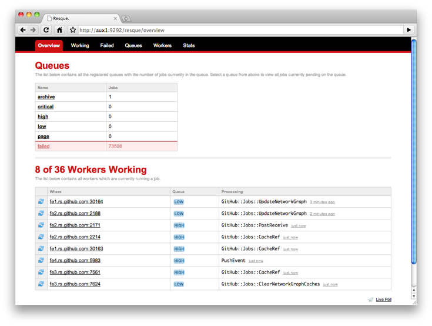

!SLIDE smbullets
# resque-web

A sinatra application to monitor things

- jobs on queues
- workers
- failed jobs

!SLIDE
# resque-web

!SLIDE
# running it up

    @@@ sh
    $ resque-web

    # responds to rack parameters
    $ resque-web -p 8282

!SLIDE
# config.ru

    @@@ Ruby
    require 'resque/server'

    run Rack::URLMap.new \
      "/"       => Your::App.new,
      "/resque" => Resque::Server.new

!SLIDE
# yeah but what about Rails

in 3 you can do this

    @@@ Ruby
    # in conf/routes.rb
    require 'resque/server'
    ...
    mount Resque::Server.new, :at => "/resque"
