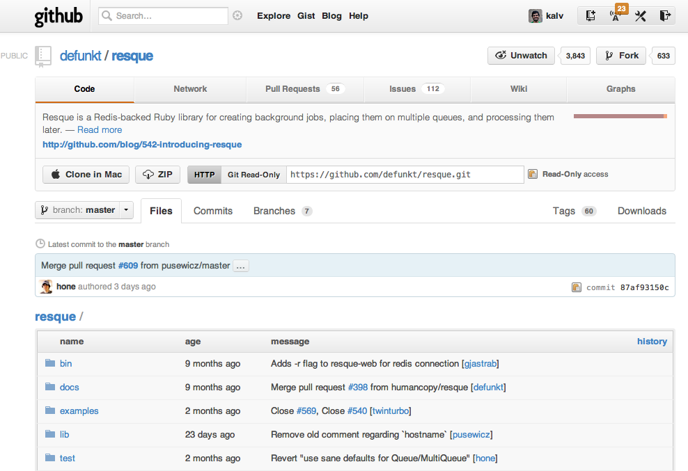

!SLIDE 
# Asynchronous processing for Rails #

## with Resque ##

### Kalvir Sandhu June 2012 ###

!SLIDE smbullets
# What you're going to get #

* The problem
* Resque overview
* Getting started
* Testing Resque
* Deployment of Resque
* Sidekiq

!SLIDE bullets

# Me - Kalv
* Twitter - @kalv
* Blog - http://kalv.co.uk
* Working on Goodbits.co

!SLIDE smbullets
# Ruby async projects to date

* Built Twitterfeed's XMPP architecture to process > 5m RSS feeds and
  publish to twitter, all in Ruby!
* Hashblue.com - Allowing UK O2 customers to access their SMS messages
  online and via an API.
* Ruby DSL to interact with VOIP Switch

!SLIDE smbullets
# The problem
- Need to offload long running tasks into the background
- Need to speed up http responses to improve user experiences
- Examples: Email sending, updating search indexes, updating activity feeds for users, etc.

!SLIDE
# Resque
## https://github.com/defunkt/resque

!SLIDE smbullets
# Resque Overview

* Built by Chris Wanstrath for Github's background processing
* Very stable and well written
* Uses Redis to pass jobs around architecture
* Dead simple job class definition

!SLIDE smbullets
# Resque components

- A library to help defining jobs to process
- Rake task to start workers to process jobs
- Also a sinatra application to monitor jobs enqueued and workers
- Workers can be distributed as it uses Redis to store jobs to be processed

