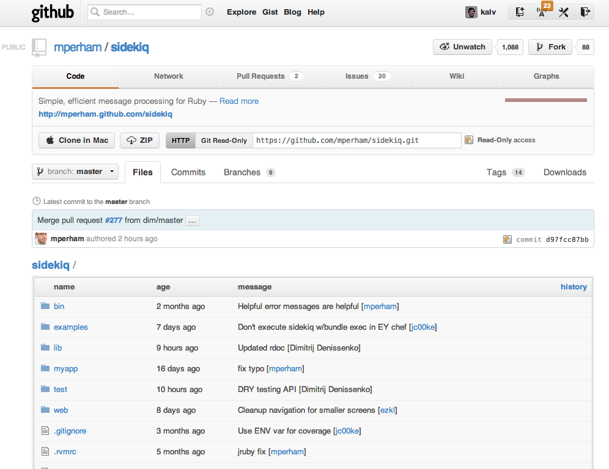

!SLIDE
# Sidekiq
## https://github.com/mperham/sidekiq

!SLIDE smbullets
# Sidekiq

- Written by Mike Perham
- Uses threads to handle many messages in one process
- Resque Compatible
- Ruby 1.8 not supported, ~> 1.9, jruby 1.6.x
- 30 x 200Mb Resque processes > 1 x 300Mb Sidekiq process

!SLIDE smbullets
# Did you say threads?

- Sidekiq built on Celluloid, https://github.com/celluloid/celluloid
- Actor pattern similar to Erlang
- No messesing around with Thread.new or Fibers and works!
- You will see big difference even with 1.9 GIL
- Get serious and run in JRuby
